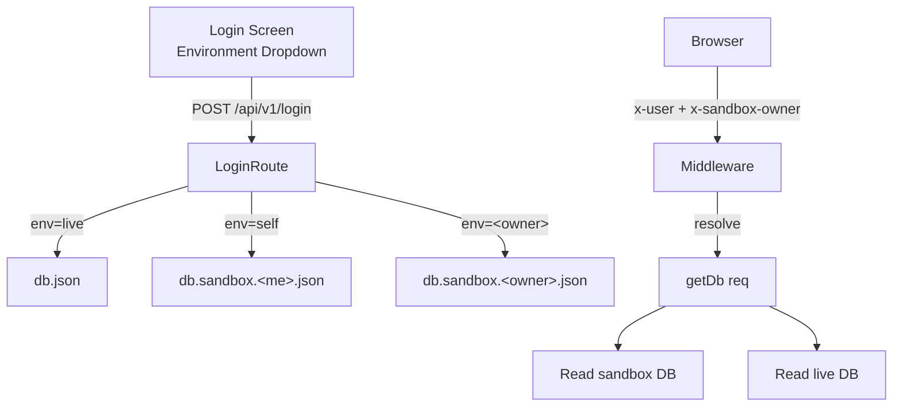

# NexusVSC Development Guide

## Tech Stack
| Layer | Tech |
|-------|------|
| Frontend | React 18 + TypeScript + Vite |
| Styling | Tailwind CSS + PostCSS |
| Backend | Node.js + Express (server.js) |
| State | React Hooks (useState/useMemo/useEffect) — no external state library |
| Build | Vite (vite.config.ts) |
| I18n | Custom context-based (contexts/LanguageContext.tsx + locales/translations.ts) |
| DB | JSON file-based (db.json) via REST API |

## Directory Layout
`
components/          # Feature modules — one file per major business function
   FinanceModule.tsx       # Invoicing, payments, P&L, tax clearances
   TechnicalReviewModule.tsx  # Part history, BoM review, line-item qty alteration
   OrderManagement.tsx     # Order CRUD, item logging, status workflow
   ProcurementModule.tsx   # POs, supplier contracts, component sourcing
   InventoryModule.tsx     # Stock levels, reservations, manufacturing completion
   ShipmentModule.tsx      # Dispatch, POD, transit tracking
   GovEInvoiceModule.tsx   # Government e-invoice upload/tracking
   CRMModule.tsx           # Customers, contacts, opportunities (supports up to 3 secondary contacts + delivery address)
   FactoryModule.tsx       # Manufacturing floor operations
   HelpModule.tsx          # Help Center with admin-managed links and video guides
   DataMaintenance.tsx     # Settings, ledger accounts, thresholds, backups
  {Feature}Modal.tsx      # Action modals (OrderDetails, AddCustomer, etc.)
  SortableTable.tsx       # Reusable sortable/draggable data table
  ModuleGate.tsx          # Role-based access wrapper
  DashboardCard.tsx       # Reusable stat card

services/
  dataService.ts          # Central API client — all backend calls go here

types.ts                  # Shared TypeScript interfaces & enums
utils.ts                  # Runtime utilities (e.g. getItemEffectiveQty, getStatusLimitHours)
shared/                   # Client + server shared code (e.g. shared/margin.js)
server.js                 # Express backend — REST API + business logic
constants.tsx             # App-wide constants (status maps, role configs)
contexts/
  LanguageContext.tsx     # I18n provider + hook
locales/
  translations.ts         # Translation keys
scripts/                  # One-off maintenance scripts (.cjs)
public/                   # Static assets served as-is
uploads/                  # User-uploaded files (PODs, invoices)
.postman/                 # Postman API collection and environment definitions
postman/                  # Postman workspace globals and shared resources
`

## Coding Patterns

### 1. Module-Per-Feature Architecture
Each business domain lives in a single large component file (e.g. FinanceModule.tsx). Modules are self-contained: they fetch their own data, manage local state, and render their own UI trees. Shared primitives (SortableTable, DashboardCard, ModuleGate) are extracted only when reused across >1 module.

### 2. Data Service Abstraction
All server communication routes through `services/dataService.ts`. Every outgoing request uses the private `getAuthHeaders()` helper, which centralizes the `x-user` header and automatically forwards `x-sandbox-owner` when the active user is in a sandbox. Backend actions are dispatched as `{ orderId, action, payload }` to a generic `dispatchAction()` endpoint for mutations, and as generic CRUD calls (`get`/`post`/`put`/`delete`) against `/api/v1/<collection>` for entities. Never call `fetch()` directly from a component.

- **Server-side collection safety:** `addToCollection` in `server.js` initializes `db[col] = []` before pushing, so missing collections are created on the fly. `updateInCollection` treats `settings` and `modules` as upserts: if the target ID does not exist, it creates the record (encrypting settings via `encryptSettings`) instead of returning 404. All other collections still return 404 on missing IDs.

### 3. Quantity Alteration Convention
When a line item's quantity can be lowered post-creation, use alteredQty + alterationComment on the item. The helper getItemEffectiveQty(item) must be used everywhere revenue, fulfillment, or BoM scaling is calculated. Original quantity is never mutated.

- **Zero/Blank Quantity Fallback:** For PO line items, a quantity of `0` or blank is automatically treated as `1` in all calculations. The fallback is read-only and enforced by `getItemEffectiveQty`; `processedOrderInternal` does **not** mutate the stored `quantity`, so original data is preserved.

- **Margin Protection Rule:** A negative-margin workflow block (`NEGATIVE_MARGIN`) is only applied when component costs have actually been identified (`totalCost > 0`) and the markup percentage falls below the configured minimum. Newly logged POs with no costs remain in `LOGGED`. Once an order enters `NEGATIVE_MARGIN`, the status is sticky: it only exits when costs are present, the markup recovers, or components are removed — preventing silent auto-regression while costs are still unknown.

- **Shared Margin / SLA Helpers:** Use `isMarginBreach(cost, markupPct, minMargin)` from `shared/margin.js` (shared by client and server) and `getStatusLimitHours(status, settings)` from `utils.ts` instead of duplicating switch statements across modules.

### 4. Modal Action Pattern
User-initiated actions (record payment, issue PO, alter qty) open a local modal with draft state. The modal validates, calls dataService, then triggers a parent refresh via callback. Modals clean up on close.

### 5. Role-Based Gating & Schema Migrations
Every top-level module route checks `ModuleGate` against the user's role. **The actual list of available roles and their module mappings live in `db.json` (the `settings.availableRoles` and `settings.roleMappings` fields).** The frontend pulls them at runtime via API.

**Schema migrations are automated.** When you add or change roles, there is no need to manually edit `db.json` on every machine. Instead, you write a small migration function in `server.js` and bump `CURRENT_SCHEMA_VERSION`. The server automatically upgrades any `db.json` on startup (or after restore) by running the migration chain. Business data (orders, customers, etc.) is never touched.

When adding or modifying roles, follow these steps:
1. `types.ts` — Add the new role to the `UserRole` union type so TypeScript compiles.
2. `constants.tsx` — Add the role to `availableRoles` and update `roleMappings` (used as defaults for fresh installs).
3. `server.js` — **Add a migration function** in the `migrations` array that adds the role to `availableRoles` and sets its `roleMappings`. Then **increment `CURRENT_SCHEMA_VERSION`**.
4. `App.tsx` — If needed, wire the new module route and nav item (only needed for entirely new views, not new roles).

> ⚠️ **Important:** Do not edit `db.json` manually on any machine. The migration system handles it. If you restore an old backup, the server will auto-migrate it on the next startup.

### 6. Dashboard Reporting
The dashboard includes a PDF export feature (executive snapshot, status distribution, critical margin alerts, and customer/supplier summaries) restricted to the `management` role. Export logic lives in `App.tsx` and uses the `jspdf` library.

### 7. Status-Driven Workflow
Orders progress through a strict enum (OrderStatus in types.ts). Server-side dispatch actions enforce valid transitions. The frontend renders stage-specific UI based on order.status, not derived flags.

### 8. Backup Segregation
Full system archive (/api/v1/full-backup) excludes users and userGroups. Those are backed up separately via /api/v1/backup-users-groups ("Export Identities").

> **Note:** The users/groups archive (`/api/v1/backup-users-groups`) also includes `helpLinks` and `helpVideos` from settings, so help center content travels with identity backups.

## Environment & Data Persistence

### `db.json` is Machine-Local
`db.json` contains all live data: users, user groups, settings, orders, customers, and uploaded file references. It is already listed in `.gitignore` and **must never be committed** to version control.

If you accidentally committed it earlier, remove it from git tracking (while keeping your local file):
```bash
git rm --cached db.json
git commit -m "Remove db.json from version control"
```

### How New Environments Are Bootstrapped
When the server starts and `db.json` is missing:
1. It first checks for `db.json.local.bak` (a safety copy created on every start).
2. If no backup exists, it copies `db.stub.json` as the initial database.

### Safe Update Workflow for Production
When pulling a new update on a production or staging machine:
1. Ensure `db.json` is not overwritten by the pull (it is `.gitignored`).
2. **Settings and roles are not automatically migrated.** If the update introduces a new role (e.g., `suppliers`), an admin must log into the application and update the settings via the UI (Settings → Roles), or run a data migration script if provided.
3. `db.stub.json` is the template for fresh installations. It should remain minimal and not contain any production data.

### Cloud Deployments & Persistent Volumes (e.g., Render)
In ephemeral hosting environments (like Render or Docker containers), the local disk is wiped on every deploy/restart. To prevent data loss:
1. **Mount a Persistent Volume:** Add a persistent volume (e.g. at `/data`) in your cloud provider's console.
2. **Set Environment Variables:** Define the following variables to point to the mounted volume:
   - `DB_PATH=/data/db.json` (stores the database settings, users, and orders on the persistent volume)
   - `UPLOADS_PATH=/data/uploads` (stores uploaded files and logos on the persistent volume)
   
This configuration decouples application code updates from your database and file assets.

### `db.stub.json` Template
The `db.stub.json` file should only contain the empty structure for a fresh database. Do not add production data, users, or custom settings to it.

## Per-User & Shared Team Sandboxes (v3.5.1)

Each user can log into one of three environments:

1. **🏢 Live ERP (Production)** — the canonical `db.json`; no header, no isolation.
2. **🧪 My Own Sandbox** — a per-user `db.sandbox.<username>.json` that is clean & empty on first login (no live credentials copied), seeded with four departmental `userGroups` and the creator's own `users` row.
3. **👥 Shared Team Sandbox** — a sandbox created by another user who invited you via User Management inside their sandbox.

The feature is **header-driven, not URL-driven**: every authenticated request carries the `x-user` header (always) and optionally `x-sandbox-owner` (when in a sandbox). The server resolves tenancy in a single middleware and every downstream handler is unaware of which DB it is reading.

### Architecture Diagram



### How the Multi-Tenant Middleware Works

`server.js` registers one middleware (after `cors()` / `bodyParser.json`, before any `/api/v1/*` route) that:

1. Reads `x-user` and (optionally) `x-sandbox-owner` from the request headers.
2. Sanitizes the sandbox owner with `sanitizeUsername()` (NFC normalize → lower → strip non-`[a-z0-9_]` → collapse runs of `_` → trim → 32-char cap → fallback `'user'`).
3. Looks up the user in `db.sandbox.<owner>.json`'s `users` array.
4. If the user is present → sets `req.sandboxDbPath`, `req.sandboxOwner`, `req.roles`. Live-only requests pass through with `req.sandboxDbPath = null` and **zero extra disk I/O**.
5. If the user is **not** in the sandbox → returns `403 ACCESS_REVOKED` and stops the request chain (revocation enforcement).

Once the middleware has run, every handler can call:

| Helper | Purpose |
|---|---|
| `getDbPath(req)` | Returns `req.sandboxDbPath ?? DB_PATH`. The single argument to every `readDb()` / `writeDb()` call. |
| `isSandbox(req)` | `Boolean(req.sandboxDbPath)`. Used in guards (`/api/v1/wipe`, `/api/v1/sandbox/reset`) and in `sendEmail` to short-circuit with `{ simulated: true }`. |
| `getDb(req)` | `readDb(getDbPath(req))`. The 27-call-site replacement for `readDb()`. |

### File Layout

| Path | Lives in | Notes |
|---|---|---|
| `db.json` | repo root | Live production DB. Always in `.gitignore`. |
| `db.sandbox.<sanitized>.json` | repo root | One per user. In `.gitignore` (added in v3.5.1). |
| `db.sandbox.<sanitized>.json.local.bak` | repo root | One-write safety copy, same convention as live. |
| `uploads/` | repo root | Live uploads (PODs, e-invoices, WHT). |
| `uploads/sandbox/<sanitized>/{pod,einvoices,wht_certificates}/` | repo root | Sandbox uploads. Created on first write. The `resolveUploadDir(req, subDir)` helper (server.js) picks the right root based on `req.sandboxOwner`. |

> **Single source of truth warning:** the four default `userGroups` in `db.stub.json`, in the personal-sandbox bootstrap at `server.js:3703-3708`, and in the spec doc are currently duplicated. A future refactor should centralize them.

### Login Flow

`POST /api/v1/login` (server.js:3627) has four branches, in this order:

1. **Factory backdoor** — only valid for the first 5 minutes after `SERVER_START_TIME`, only into Live, password checked against `FACTORY_PASS`.
2. **Live** — verify against `db.json` users.
3. **Self** — verify against `db.json` (user must exist in Live); if `db.sandbox.<me>.json` is missing, bootstrap it from `db.stub.json` + 4 default `userGroups` + the live user entry; return `{ sandbox: true, sandboxOwner: <sanitized>, sandboxLabel: "My Own Sandbox (<name>)" }`.
4. **Shared** — verify against `db.sandbox.<owner>.json` users; return the matching user with `sandboxOwner = <owner>`.

The login response is stored in `localStorage` under `nexus_user`. Every subsequent request sends `x-sandbox-owner` if the saved user has `sandbox: true` (wired in `services/dataService.ts:46-62`).

### Frontend UX

- **Login screen** (`components/Login.tsx`): the username field triggers a 300 ms debounced call to `/api/v1/auth/environments` (TTL-cached server-side for 30 s; 60 s eviction sweeper on a `Map`). The dropdown shows 🏢 Live, 🧪 My Own Sandbox, 👥 any shared team sandboxes the user has access to. Selecting one POSTs to `/api/v1/login` with `environment: <id>`.
- **Persistent banner** (`App.tsx:807-835`): when `currentUser.sandbox` is true, a top banner shows the environment label, the active user, and two actions:
  - **Reset Data** → opens a modal that requires the user to type `"RESET"` (uppercase) before posting to `/api/v1/sandbox/reset`.
  - **Exit Sandbox** → clears `localStorage` and returns to the login screen.
- **Footer version** (`components/Login.tsx:158`): bumped to `v3.5.0-Sandbox` in this release.

### Safety Guards

| Guard | Where | Behavior |
|---|---|---|
| `/api/v1/wipe` | `server.js:2124` | Returns `400 Direct wipe is disabled in sandbox mode. Use /api/v1/sandbox/reset.` when `isSandbox(req)`. |
| `/api/v1/sandbox/reset` | `server.js:2132` | Returns `400 Must be in sandbox mode.` if called from Live. On success: clears the six business arrays (orders, customers, inventory, notifications, contracts, supplierPayments) in the user's sandbox DB, preserves `users` and `userGroups`, deletes and recreates `uploads/sandbox/<owner>/`. |
| `sendEmail(..., req)` | `server.js:1307` | Short-circuits with `{ success: true, simulated: true }` when `isSandbox(req)`. Three call sites (threshold audit, new-order notification, PO rollback) all pass `req` already — only the function definition needed to accept it. |

### Startup Migration Sweep

`migrateAllSandboxesOnStartup()` runs synchronously **before `app.listen()`** and:

1. Reads `__dirname` for any `db.sandbox.*.json` (excluding `.local.bak`).
2. For each, checks `settings[0].dbSchemaVersion` against `CURRENT_SCHEMA_VERSION`.
3. If behind, runs the migration chain via `applySchemaMigrations(db, targetPath)`.
4. Logs `migrated / skipped / errored` counts.

On-read migration in `readDb()` is still a backstop, so a sandbox DB that gets created after boot is also fine.

### Discovery Cache

`/api/v1/auth/environments` returns the list of environments a user can log into. The response is cached in a `Map` keyed by username, with a 30 s TTL. A `setInterval(..., 60000).unref()` sweeper evicts expired entries so the `Map` stays bounded.

The endpoint also requires `x-user` and `?username=` to match (case-insensitive) before returning the personal + shared lists. Without a match, only the Live environment is returned — preventing unauthenticated enumeration.

### Configuration

- **No new environment variables.** The feature uses the existing `DB_PATH` (for live) and derives sandbox paths via `path.join(__dirname, 'db.sandbox.' + sanitizeUsername(owner) + '.json')`.
- **`vite.config.ts`** `server.watch.ignored` was extended to `**/db.sandbox.*.json` and `**/db.sandbox.*.json.local.bak` so HMR does not restart on every sandbox write during development.

### Where to Read the Spec

The full architecture spec (with mermaid diagrams, code samples, and the implementation status amendment) lives at:

```
C:\Users\moata\.local\share\kilo\plans\1786643099095-user-sandbox-plan.md
```

The current implementation is documented as **Amendment v3.5.1** at the top of that file. Anyone touching the sandbox code should re-read the amendment first.

### Open Concerns (from Amendment v3.5.1)

- **`/uploads` static-serve guard + HMAC signed file URLs** — deferred together; only matter if a static-serve path is ever added. Right now no `app.use('/uploads', express.static(...))` exists.
- **`db.stub.json` userGroups triplication** — duplicated in `db.stub.json`, `server.js:3703-3708`, and the spec doc. Centralize when convenient.


### Sensitive Data Encryption (LLM Tokens, SMTP Password)
Sensitive API keys and passwords are protected using AES-256-CBC encryption at rest in `db.json`. The encryption key is derived from the factory server passphrase (`FACTORY_PASS`) and should **never** be changed once the system is in production, as it would render existing encrypted values unreadable.

**Encrypted fields:**
- `settings.geminiConfig.apiKey`
- `settings.openaiConfig.apiKey`
- `settings.emailConfig.password`
- `settings.googleDriveConfig.refreshToken`

**How it works:**
- **On read (GET /api/v1/settings):** The server decrypts these fields before sending them to the frontend so the app can use the keys.
- **On write (PUT/POST /api/v1/settings):** The server encrypts these fields before saving them to `db.json`.
- **On backup (/api/v1/backup):** Settings remain encrypted in the backup file; they are **not** decrypted for export.
- **On restore (/api/v1/restore):** The server checks if incoming values are already encrypted (skips re-encryption if they are) or encrypts plaintext values. This makes restore idempotent and safe.
- **On full-backup (/api/v1/full-backup):** The entire archive is encrypted with the user's passcode using AES-256-GCM. On full-restore, the archive is decrypted and extracted as-is (settings remain encrypted on disk).

### VITE_BACKEND_URL Configuration
The frontend uses `VITE_BACKEND_URL` to determine the API base URL. It defaults to an empty string, which causes all requests to use relative paths (same origin).

**Development:**
- Vite dev server runs on port `5005` and proxies `/api` to `http://localhost:3006` (see `vite.config.ts`).
- No need to set `VITE_BACKEND_URL` in local development if the backend runs on port `3006`.

**Production (e.g. Render):**
- The Express server (`server.js`) serves the built frontend from `dist/` on the same origin.
- Leave `VITE_BACKEND_URL` unset (or set to `''`). The `render.yaml` `startCommand` is `node server.js`.
- If you ever deploy the frontend and backend on **separate origins**, set `VITE_BACKEND_URL` to the backend origin (e.g. `https://api.example.com`).

### Google Drive Integration (Per-Customer Instance)
This app is distributed per customer copy (not SaaS), so each customer configures Google Drive from the UI:

- Open **System Core Control -> Integrations**
- Enter **Google Client ID** and **Google Client Secret**
- Optionally set **OAuth Redirect URI** (leave blank to auto-generate from current origin)
- Set **Target Drive Folder Name**
- Save settings, then click **Connect Google Account**

Folder targeting uses a human-friendly folder name in settings (`googleDriveConfig.folderName`). During upload the backend:
- searches Google Drive for a folder with that exact name,
- reuses it if found,
- otherwise creates it automatically,
- and caches its ID internally (`googleDriveConfig.folderId`).

Recommended OAuth redirect URIs for this project:

- `http://localhost:3005/api/v1/integrations/google-drive/callback`
- `https://nexuserp-nrh3.onrender.com/api/v1/integrations/google-drive/callback`

## Adding a New Feature
1. Component: Create components/{Feature}Module.tsx (or Modal.tsx if it's an action).
2. Types: Add interfaces to types.ts. Export runtime helpers alongside interfaces if needed.
3. Service: Add API methods to dataService.ts.
4. Server: Add dispatch action cases to server.js.
5. Constants: Register role mapping in constants.tsx.
6. **Database (`db.json`):** If the feature involves new roles or settings, update the actual database settings object. This is the **authoritative runtime source** — if skipped, the feature will not appear on this machine even though the code is correct.
7. Router: Wire the component + ModuleGate into App.tsx.

## Application Versioning Protocol

Every code update must advance the application version by **+0.00001** just before rebuilding the application.

### How It Works
- The application version is defined in `constants.tsx` as `APP_VERSION` (string format).
- Starting version: `1.0000000`
- Increment: `0.00001` per update
- Displayed at the bottom of every page in small font via `components/VersionFooter.tsx`

---

## Build, Run, and Deploy Lifecycle

To make development structured, building the application and pushing changes are treated as separate, distinct steps.

### Step 1: Rebuilding and Restarting (Local Development / Staging)
When you say **"rebuild"**, this command performs the following sequence *only* (it does not commit or push the code):

1. **Advance the Version:** 
   Open `constants.tsx`, locate `export const APP_VERSION = 'X.XXXXXX';`, increment the value by `0.00001`, and save the file.
2. **Install Dependencies:**
   Ensure dependencies are up to date:
   ```bash
   npm ci
   ```
3. **Build the Application:**
   Compile the frontend production assets into `dist/`:
   ```bash
   npm run build
   ```
4. **Restart the Application:**
   Start the Node.js Express server to serve the API and the newly compiled frontend (runs on port 5005 by default):
   ```bash
   node server.js
   ```
   *Note: Access the application locally at http://localhost:5005.*

   > ⚠️ **IMPORTANT:** When restarting the app, ensure you only stop the specific process bound to port `5005` (e.g., using `Get-NetTCPConnection -LocalPort 5005` to find the PID). Never run wildcard process-killing commands like `Stop-Process -Name node` or `taskkill /IM node.exe /F` which would disrupt other running applications on different ports.

### Step 2: Committing and Pushing (Separate Action)
When the user says **"commit and push"**, this triggers pushing the code to remote version control. This step is executed *only when explicitly requested* and does **not** trigger a rebuild.

> ⚠️ **CRITICAL RULE FOR AI AGENTS:** Do NOT commit and push changes to remote version control unless the user asks you clearly and explicitly to do that.

1. **Add and Commit Changes:**
   ```bash
   git add .
   git commit -m "Fix/Feature: Description of the changes"
   ```
2. **Push to Branch:**
   ```bash
   git push origin <branch-name>
   ```

---

## Key Files to Read First
- types.ts — Domain model
- server.js (lines 1-300) — Dispatch router + action patterns
- services/dataService.ts — API surface
- constants.tsx — Status colors, role definitions, module config

### Help View & Help Settings
- `types.ts` — Contains `HelpLink` interface and `helpLinks?: HelpLink[]` in `AppConfig.settings`
- `components/HelpModule.tsx` — User-facing help view accessible to all roles, displays clickable links with descriptions
- `components/DataMaintenance.tsx` — Admin-only settings tab for managing help links (URL + description) and video URLs
- Help links are stored in `settings.helpLinks` and displayed in the Help Center
- Video URLs are stored in `settings.helpVideos` and displayed as YouTube links
- Schema migration v2 initializes `helpLinks` array if missing on db.json load

### Blanket Orders & Contracts Management
Exposes a tabbed workflow inside Order Management to create abstract contracts and reference them when logging Blanket Orders, which are then settled in Finance.
- `types.ts` — Defines the `Contract` interface (lines 312-319) and adds optional `contractId?: string` to `CustomerOrder` (line 309).
- `server.js` — Bumps `CURRENT_SCHEMA_VERSION` to `4` (line 24). Registers `'contracts'` in the generic CRUD `COLLECTIONS` registry (line 2021). Inserts the v3 → v4 migration block (lines 703, 735-737) to initialize `db.contracts = db.contracts || []` on launch.
- `services/dataService.ts` — Exposes Contracts client CRUD endpoints (`getContracts`, `addContract`, `updateContract`, `deleteContract`) referencing the generic API (lines 228-235).
- `components/OrderManagement.tsx` —
  - Renames `'New Acquisition'` tab button to `'New Orders'` (line 1009).
  - Hides/removes all Blanket Order check box toggles and contract references from the `'New Orders'` tab form.
  - Adds `'Blanket Orders'` tab (line 1010-1033) which manages three sub-tabs:
    - **New Blanket Order:** Implies/forces `blanketOrder` to `true` (checkbox is hidden), rendering only the `Linked Contract Reference` select dropdown (lines 1461-1488).
    - **New Contract:** Form to log a new contract, selecting the customer name from CRM and including Received Date (defaulted to today).
    - **Logged Contracts:** Renders a list of all logged contracts using `SortableTable` (lines 1708-1745) with draggable column re-ordering, search box, default oldest-to-newest sort on Contract Date, delete action, and "Log Blanket" shortcut pre-selecting the contract.
  - `components/FinanceModule.tsx` — Re-architected the `contracts` tab (lines 1445-1485) to render the contracts collection using `SortableTable`. Features include a general search input box, draggable column re-ordering, default oldest-to-newest sorting on Contract Date, no Contract Value column, and nesting Settle / Financial Request actions directly for each linked Blanket Order under the Action column. Displays the customer's PO reference badge directly beside the internal order number in all operational and tax clearance contexts, and expands the search engine to match against any part of the PO reference, customer name, internal order ID, invoice number, contract ID, project name, dates, status, currency, and line item/component descriptions.
  - **'Logged Orders' Tab Search & Universal Order Registry:** Lists all active logged orders (both standard/normal orders and blanket orders). Includes a real-time search input that matches any part of any displayed field (internal order reference, PO reference, customer entity name, dates, timestamps, submitted-by user, last-edited user, blanket/normal status, compliance/margin tags, and line item/component descriptions). Displays distinct badges (`Blanket` vs `Normal`) alongside linked contract and project IDs.

---

## Part Number & Sourcing Rules

### 1. Mandatory Part Number / SKU Uniqueness Rule
Every component Part Number / SKU must be **strictly unique** within its catalog domain:
- **Supplier Price Lists:** `partNumber` must be unique per supplier (enforced in `dataService.addPartToSupplier`, `dataService.updatePartInSupplier`, `SupplierModule.tsx` manual form, and inline editing).
- **Inventory Items:** `sku` must be unique across all inventory records (enforced in `InventoryModule.tsx`).
- **Validation:** All comparisons are normalized (whitespace-trimmed and case-insensitive). Attempting to add or edit a duplicate Part Number throws a validation error and blocks saving.

### 2. Sourcing Catalog Auto-Complete Relevance Ranking Engine
The auto-complete dropdown in **Technical Review** (`TechnicalReviewModule.tsx`) and **Studying** (`StudyingModule.tsx`) utilizes `calculateCatalogMatchScore` (`utils.ts`) to prioritize suggestions:
- **Score 1000:** Exact Part Number / SKU match (e.g. searching `65674204` places that exact part at Rank #1).
- **Score 800:** Part Number prefix match.
- **Score 600:** Item Description prefix match.
- **Score 400:** Part Number substring match.
- **Score 200:** Item Description substring match.
- **Score 100:** Vendor / Supplier name match.
- **Dual-Field Matching:** If search terms are entered into both the Part Number and Component Description fields, dual matches receive a `+500` bonus. Permissive scoring prevents a term in one field from rejecting valid matches in the other.

### 3. Role-Gated Supplier Part Editing (Administrators Only)
- In `SupplierModule.tsx`, inline part editing (<i className="fa-solid fa-pen-to-square"></i>) is strictly restricted to users with the `admin` role (`isAdmin = userRoles.includes('admin')`).
- Non-administrators cannot see or trigger the edit button.
- Updates are saved via `dataService.updatePartInSupplier` and update the supplier record and audit trail in `db.json`.

### 4. Dedicated 'Active Suppliers' & 'Deleted Suppliers' Navigation Tabs
- In `SupplierModule.tsx`, the interface is organized into two primary top-level tabs:
  - **Active Suppliers:** Shows active commercial vendors and controls price list management, registration, and logs.
  - **Deleted Suppliers (Admin Only):** Displays the immutable archive vault with full search, counters, and locked part items.

### 5. Part Deletion, 'Deleted Suppliers' Vault, and Strict Immutability
- **Automatic Migration on Deletion:** When any part is deleted from a supplier's price list, it is removed from that supplier and automatically moved into a dedicated archive vault supplier named `'Deleted Suppliers'` (`isDeletedSupplier: true`). Metadata is preserved on the part (`originalSupplierId`, `originalSupplierName`, `deletedAt`).
- **Hidden from Non-Administrators:** The `'Deleted Suppliers'` supplier is completely hidden from non-admin users in `SupplierModule.tsx`, and is filtered out of sourcing catalogs (`TechnicalReviewModule.tsx`, `StudyingModule.tsx`), and procurement selection (`ProcurementModule.tsx`).
- **Strict Immutability Rule:** Parts inside `'Deleted Suppliers'` are permanently locked. They cannot be modified, edited, or deleted by **anyone, including administrators**. All edit/delete UI actions and backend endpoints enforce this rejection.

### 6. Real-Parts Only Autocomplete & Dedicated Part Order History
- **Autocomplete Scope:** Autocomplete dropdowns in Sourcing Catalogs (`TechnicalReviewModule.tsx` and `StudyingModule.tsx`) strictly search **real, active catalog items** (`INVENTORY` stock and active `SUPPLIERS` price lists). Past customer order components are excluded from autocomplete suggestions to prevent phantom or duplicate suggestions.
- **Part Order & Customer History:** Users can view the historical customer order usage of any real part by clicking the <i className="fa-solid fa-clock-rotate-left"></i> icon in the **Commercial Price List**, **Deleted Suppliers Vault**, or **Technical Review Sourcing Catalogs**. The modal displays all past customer orders where the part was used, including the internal order number, customer name, PO reference, date, logged description, quantity, unit cost, and order/component status.

### 7. Procurement PO Reference Display & Universal Search
- **PO Reference Header Badge:** In `ProcurementModule.tsx`, every order card header prominently displays the customer's PO reference badge (`PO: <customerReferenceNumber>`) alongside the internal order number in both the **Trade/Manufacturing** (`purchases`) and **Blanket Orders** (`outsourcing`) views.
- **Universal Multi-Field Search Box:** A dedicated search input in the Procurement section header filters orders in real time across all visible attributes, including internal order numbers, customer PO references, customer names, project names, item order numbers & descriptions, part numbers, component descriptions, supplier names, supplier part numbers, PO numbers, RFP IDs, and manufacturing steps.

---

## Server & Runtime Architecture Updates

### 1. Login Environment Discovery & Sandbox Selection
- The `/api/v1/auth/environments` discovery endpoint evaluates `req.query.username || req.headers['x-user']`.
- If no username has been entered yet, it immediately provides both **Live ERP (Production)** and **Personal Sandbox (Isolated Testing)** so the sandbox option is always available on the login screen.
- When a username is typed, it debounces (250ms) to resolve `My Own Sandbox (<User Name>)` and any shared team sandboxes.

### 2. Dedicated Single-Port Operation
- The backend server (`server.js`) listens **exclusively on port `5005`** (`http://localhost:5005` or `process.env.PORT`).
- Ports `3005` and `4005` are completely freed for external services.

### 3. Resilient Database Persistence
- `writeDb` in `server.js` employs atomic write via `.tmp` file renaming with an automatic direct-write fallback to handle temporary Windows / OneDrive filesystem locks (`EPERM`).
