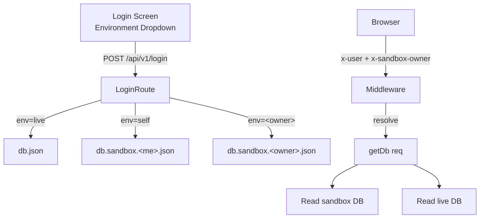

# DEVELOPMENT.md

NexusVSC / NexusERP — a per-customer ERP (Finance, Procurement, Inventory, Manufacturing, Shipment, CRM, Gov E-Invoice). One repo = one customer copy, distributed as an installed app (not SaaS).

This file is the **single source of project truth for developers and AI agents** — it consolidates and absorbs all developer specifications, agent guidelines, and operational procedures. If you change a project rule or feature architecture, update it here.

---

## Tech stack

| Layer | Tech |
|---|---|
| Frontend | React 19 + TypeScript + Vite 6 |
| Styling | Tailwind CSS 4 (via `@tailwindcss/postcss`) + PostCSS |
| Backend | Node.js + Express 5 (single `server.js`) |
| State | React hooks only — no Redux/Zustand |
| DB | JSON file (`db.json` + `db.sandbox.*.json` for v3.5.1 sandboxes) over REST |
| i18n | Custom `LanguageContext` + `locales/translations.ts` |
| AI | Gemini (`@google/genai`) + OpenRouter/OpenAI with multi-model fallback engine |
| Auth | `x-user` header (always) + `x-sandbox-owner` header (in sandboxes) |

---

## Fastest path to a code change

1. **Find the feature module.** `components/{Feature}Module.tsx` — one file per business domain (see "Components by business domain" below).
2. **Read the type.** `types.ts` is the domain model. Add/modify interfaces here first.
3. **Read or add the API surface.** `services/dataService.ts` is the only HTTP client. Never call `fetch()` from a component.
4. **Read or add the server handler.** `server.js` registers routes near the top and a generic dispatch action endpoint `{ orderId, action, payload }` for mutations; generic CRUD lives at `/api/v1/<collection>`.
5. **Touch the DB carefully.** Roles and module mappings live in `db.json` `settings.availableRoles` / `settings.roleMappings`. Do not edit `db.json` by hand — use the schema migration system (see "Hard rules" §5).

---

## Setup commands

```bash
npm install            # install deps
npm run dev            # Vite dev server on :5005, proxies /api -> :3006
node server.js         # production-style: Express serves dist/ + API on :5005
npm run build          # Vite build -> dist/
```

> The backend listens **exclusively on port 5005** (or `process.env.PORT`). Ports 3005 / 4005 are intentionally free for external services. To restart, kill only the PID bound to 5005 — **never** `Stop-Process -Name node` or `taskkill /IM node.exe /F` (see "Build, Run, and Deploy Lifecycle" below).

**`VITE_BACKEND_URL`:** defaults to empty string → relative paths → same origin. Leave it unset in dev (Vite proxies `/api` to `:3006`) and in production (Express serves `dist/` on the same origin). Set it only when API and frontend are deployed to **different origins**.

There is no `npm test`. Functional tests are Node scripts in repo root (`test_*.js`, `verify_*.js`) and `scripts/*.cjs` (one-off maintenance). Run them with `node test_*.js`.

---

## Project layout (entry points only — for the rest, `ls <dir>`)

```
DEVELOPMENT.md           # this file (the single consolidated project truth)
AGENTS.md                # pointer to DEVELOPMENT.md for AI agent discovery
README.md                # AI-Studio stub; ignore for real work
App.tsx                  # root component, view router, sandbox banner, login/logout
index.tsx                # ReactDOM.createRoot mount
server.js                # Express: routes, dispatch, sandbox middleware, encryption, migrations
types.ts                 # domain model + enums (OrderStatus, UserRole, etc.)
constants.tsx            # APP_VERSION, status colors, role defaults, INITIAL_CONFIG
utils.ts                 # getItemEffectiveQty, getStatusLimitHours, calculateCatalogMatchScore
shared/margin.js         # isMarginBreach (used by both client and server)
vite.config.ts           # port 5005, /api -> :3006 proxy, sandbox files in watch.ignored
tsconfig.json            # ES2022, react-jsx, path alias "@/*" -> ./*
render.yaml              # Render deploy (buildCommand + startCommand)

components/              # one file per business feature (see "Components by business domain")
services/dataService.ts  # the only HTTP client; getAuthHeaders() centralizes x-user + x-sandbox-owner
contexts/                # LanguageContext (i18n)
locales/translations.ts  # translation keys

.postman/  postman/      # Postman collection + workspace globals
uploads/                 # user uploads (PODs, e-invoices, WHT) — gitignored
dist/                    # vite build output — gitignored
db.json                  # live DB — gitignored, never commit
db.sandbox.*.json        # per-user / shared team sandboxes — gitignored
db.stub.json             # fresh-install template (commit-worthy; no prod data)
```

### Components by business domain

| Module | File | Approx. size |
|---|---|---|
| Order entry, line items, blanket orders, contracts | `components/OrderManagement.tsx` | ~118 KB |
| Technical review, BoM review, sourcing catalog | `components/TechnicalReviewModule.tsx` | ~123 KB |
| Procurement (POs, outsourcing, supplier contracts) | `components/ProcurementModule.tsx` | ~261 KB (largest) |
| Inventory (stock, reservations, mfg completion) | `components/InventoryModule.tsx` | ~51 KB |
| Suppliers / deleted-suppliers vault / price lists | `components/SupplierModule.tsx` | ~77 KB |
| Stock reception | `components/StockReceptionModule.tsx` | ~14 KB |
| Manufacturing floor | `components/FactoryModule.tsx` | ~19 KB |
| Dispatch, POD, transit tracking | `components/ShipmentModule.tsx` | ~39 KB |
| CRM (customers, contacts, opportunities) | `components/CRMModule.tsx` | ~41 KB |
| Finance (invoicing, payments, P&L, tax clearances, contracts) | `components/FinanceModule.tsx` | ~196 KB |
| Government e-invoice upload/tracking | `components/GovEInvoiceModule.tsx` | ~24 KB |
| Strategic AI assistant (Gemini + multi-model fallback) | `components/AIAssistant.tsx` | ~30 KB |
| Dashboard, profitability report, order report, system logs | `DashboardCard.tsx`, `ProfitabilityReport.tsx`, `OrderReport.tsx`, `SystemLogs.tsx` | mixed |
| Settings / thresholds / ledger accounts / backups | `components/DataMaintenance.tsx` | ~155 KB |
| Help center + admin-managed links/videos | `components/HelpModule.tsx` | ~10 KB |
| Role-gated access wrapper | `components/ModuleGate.tsx` | <1 KB |
| Login + environment dropdown | `components/Login.tsx` | ~9 KB |
| Reusable sortable/draggable table | `components/SortableTable.tsx` | ~7 KB |
| Reusable stat card | `components/DashboardCard.tsx` | ~3 KB |

> **Module size matters:** Finance, Procurement, DataMaintenance, and Technical Review are the four "everything accumulates here" modules. Don't try to read them top-to-bottom — use the entry points below.

---

## Feature entry points (read these first, then dive in)

When asked to change a feature, land on the row below, not on the file. All line numbers are in the current tree as of v0.0.2000026.

### Order Management

- **Module:** `components/OrderManagement.tsx` (top of file = "New Orders" tab + item form)
- **Order details modal:** `components/OrderDetailsModal.tsx:1` (the longest single screen the user sees)
- **Type:** `OrderStatus` enum + `CustomerOrder` interface in `types.ts`
- **Server dispatch:** `server.js:2441` `POST /api/v1/orders/:id/dispatch-action` — every status change, BoM commit, blanket-order link, item qty alter goes through here
- **Server switch (action cases):** `server.js:2500` `switch (action) { ... }` — add your new `case 'your_action':` here
- **Effective qty helper (used everywhere revenue/BoM is computed):** `utils.ts` `getItemEffectiveQty`
- **Contracts (Blanket Orders):** `server.js:2387` `COLLECTIONS` registry has `'contracts'`; `OrderManagement.tsx` 'Blanket Orders' tab; `FinanceModule.tsx` 'contracts' tab renders them via `SortableTable`
- **Blanket classification rule:** `isOrderBlanket` evaluates only the explicit `blanketOrder: true` flag — outsourcing items or component contracts no longer classify as Blanket Orders. Procurement's "Blanket Orders" tab was renamed to "Outsourcing" to avoid confusion (see i18n keys).
- **Sortable columns & Last Edited:** Table supports sorting by `lastEdited` (computed via `getLastEditedInfo(order)` inspecting human user logs while excluding `System`), `dataEntryTimestamp`, `customer`, etc.

### Technical Review

- **Module:** `components/TechnicalReviewModule.tsx`
- **SLA tracking & auto-transition:** Technical Review SLA starts from initial order logging or rollback (`technicalReviewStartedAt`, computed via `getTechReviewStartTime` in `utils.ts`). Item acceptance via `toggleAcceptItem` automatically moves orders in `LOGGED` status to `TECHNICAL_REVIEW`. When the order leaves technical review or is rejected, `technicalReviewFinishedAt` is recorded.
- **Header indicators:** Order header displays `ThresholdDisplay` for SLA countdown / overdue metrics.
- **Rollback to Logged & Dimmed Lock:** When a PO in Technical Review (blanket or non-blanket) is rolled back to `LOGGED`, it is assigned `rolledBackToLogged: true` and receives a fresh SLA clock (`dataEntryTimestamp` and `technicalReviewStartedAt` reset). The PO remains visible in the Technical Review queue but is styled as **dimmed** with a lock badge (`Rolled Back — Pending Logging Update`), and all editing actions (workflow switching, component addition, BoM modifications, position approval, finalization, and re-rollback) are locked with an explicit message that it cannot be edited until the Order Management / Logging team updates it. When the Order Management team updates the order in Order Management (`PUT /api/v1/orders/:id`), `rolledBackToLogged` is cleared, fresh SLA clocks are initialized, and full Technical Review edit capability is restored.

### Procurement

- **Module:** `components/ProcurementModule.tsx` (largest module — uses `SortableTable` everywhere; both `purchases` and `outsourcing` views in one file)
- **Server:** `server.js:2280` `GET /api/v1/procurement/history` (cross-order procurement history)
- **Type:** `ProcurementLine` in `types.ts`
- **PO reference / project badges:** procurement headers always render the customer's PO ref + project/non-project indicator
- **Cost sheet data population & per-project extraction:** For outsourcing orders, cost sheet metrics (working resource count and total real cost) are extracted per project from the uploaded cost sheet by matching the order's project name to its `"اجمالى <project>"` block (person count + right-most column sum). If an order specifies a project not present in the sheet, it displays 0/0 and warns the user with available sheet projects. Falls back to whole-sheet extraction if no project block is matched.
- **Interactive Cost Sheet Cascading Formulas & Excel Baking:**
  - In the interactive cost sheet editor, formulas are recomputed live via `computeResolvedCostSheetValues(cells, rowOffset, colOffset)` using a multi-pass (up to 6 passes) fixed-point engine. Formulas referencing other calculated cells dynamically update as editable green cells are typed into.
  - On save, resolved formula values are written into each formula cell's cached value (`worksheetCell.v = val`), allowing downstream parsers using `XLSX.utils.sheet_to_json` to immediately reflect updated Working Resource counts, Real Costs, and invoice totals.
- **Cost sheet history, latest active sheet & deletion rollback:**
  - `targetItem.costSheets[]` maintains full upload history. History chips displayed on Outsourcing order cards are filtered strictly to cost sheets uploaded/modified in the **current calendar month**, while the latest active sheet drives the card's main metrics (working resources and real cost).
  - The latest uploaded sheet in the current month is highlighted (`★ Latest`, green border and ring).
  - "View Sheet" and "Real Cost to Company" always show and evaluate against the latest active uploaded sheet.
  - Older historical sheets are download-only and cannot be opened in the interactive editor.
  - A small Delete button appears under the latest sheet chip. Clicking it triggers `delete-cost-sheet-record` (`server.js:3320`), which removes the record, promotes the previous record as active, restores previous `costSheetFile` and metrics (`workingResourceCount`, `realCost`, `invoiceTotal`), and syncs component costs. When only 1 sheet remains, the Delete button is disabled/dimmed to preserve the active cost sheet.
- **Blanket Order Project Consolidation & Project Orders History:**
  - In the Procurement Outsourcing tab (`components/ProcurementModule.tsx`), blanket orders (`isOrderBlanketType(order)`) sharing the same project name (`getOrderProjName(order)`) are consolidated into a single card ("as if they were one large order").
  - The card header prominently displays quick info for the "latest" order in that project: Customer PO Number, Internal Order Number, and PO Received Date.
  - A toggleable "Project Orders History" dropdown link in the header opens an embedded subcard showing all orders in the project row by row: Customer PO Number, Internal Order Number, Received Date, and download pills for all cost sheets uploaded during that order's PO calendar month.

### Inventory

- **Module:** `components/InventoryModule.tsx`
- **Stock-reception sub-view:** `components/StockReceptionModule.tsx` (PO goods-in; creates inventory)
- **Unique SKU rule:** enforced in `InventoryModule.tsx` (case-insensitive, whitespace-trimmed)
- **Server:** generic `GET/POST/PUT/DELETE /api/v1/inventory` (registered in `COLLECTIONS` at `server.js:2387`)

### Suppliers

- **Module:** `components/SupplierModule.tsx`
- **Deleted-Suppliers vault** (admin-only, strictly immutable): handled inside the same module
- **Admin-only inline edit:** `isAdmin = userRoles.includes('admin')` gate — preserve when extending
- **Type:** `Supplier` + `SupplierPart` in `types.ts`
- **Server:** generic `GET/POST/PUT/DELETE /api/v1/suppliers`; autofill rank `calculateCatalogMatchScore` in `utils.ts`

### Manufacturing (Factory)

- **Module:** `components/FactoryModule.tsx`
- **Production start / finish flows:** see `test_production_start.js`, `test_production_finish.js` in repo root for the exact HTTP shape
- **Test scripts:** `test_mfg_consumption.js`, `test_mfg_consumption_v2.js`, `test_mfg_start_consumption.js` are the canary scripts for this area

### Shipment / Dispatch

- **Module:** `components/ShipmentModule.tsx`
- **POD uploads:** land in `uploads/{pod,einvoices,wht_certificates}/` (or `uploads/sandbox/<owner>/...`); file-serving is local-only, no CDN
- **Server:** `/api/v1/integrations/storage/upload` at `server.js:4797`; Google Drive upload at `server.js:4733`

### CRM

- **Module:** `components/CRMModule.tsx`
- **Add-customer modal:** `components/AddCustomerModal.tsx`
- **Customer merge:** `server.js:2327` `POST /api/v1/customers/merge`
- **Type:** `Customer` in `types.ts`

### Finance

- **Module:** `components/FinanceModule.tsx` (huge — 196 KB)
- **Collapsible order cards** (default closed) + Expand All/Collapse All toolbar control — preserve this UX
- **Universal multi-query search** supports `project` / `non-project` keywords — preserve
- **Blanket History Tab (`blanket_history`):** Dedicated monthly archive view grouping blanket orders by creation month (descending order) with search filtering and direct one-click download buttons for each order's latest uploaded cost sheet (`downloadCostSheetFile`).
- **Blanket vs. Non-Blanket Indicators:**
  - `showBlanketBadge` displays a teal **Blanket** badge only when the order is associated with a blanket contract (`blanketOrder || contractId || blanketContractId`) **and** Procurement has certified that "No RFP Needed" (`isOrderNoRfpNeeded(o)`).
  - Otherwise, displays a **Non-Blanket** badge with tooltip explaining whether it is a standard order or awaiting Procurement's No RFP Needed clearance.
- **Settle blanket order / financial request** action lives in the contracts table within this module
- **Type:** `LedgerEntry` in `types.ts`
- **Server:** generic `GET/POST/PUT/DELETE /api/v1/ledger`; supplier payments at `server.js:4904-4997`
- **PDF export:** dashboard's executive snapshot (status distribution, critical margin alerts, customer/supplier summaries) is restricted to the `management` role; uses `jspdf`, lives in `App.tsx`.

### Government e-Invoice

- **Module:** `components/GovEInvoiceModule.tsx`
- **WHT certificates** also stored in `uploads/wht_certificates/`

### AI Assistant (strategic + OCR)

- **Module:** `components/AIAssistant.tsx`
- **Server proxy (OpenAI-compatible):** `server.js:5106` `POST /api/v1/ai-proxy/chat` — single point where browser calls go through
- **Multi-model fallback queue:** the OCR engine in `OrderManagement.tsx` and this module share the same queue; do not bypass with raw SDK calls
- **Sandbox context:** the assistant ingests `isSandbox` / `sandboxOwner` / `environmentName` automatically

### Settings / Data Maintenance

- **Module:** `components/DataMaintenance.tsx` (largest settings surface — thresholds, ledger accounts, encryption, backups, help content, integrations, user management, sandbox admin)
- **Integrations:** Google Drive OAuth routes at `server.js:4522-4797`; local storage at `server.js:4546-4596`
- **Backups:** full backup `server.js:3743`; users+groups `server.js:4001`; restore `server.js:3809`; full-restore `server.js:3882`
- **Settings persistence (encryption):** see "Sensitive data encryption" below

### Help Center

- **Module:** `components/HelpModule.tsx` (user-facing; displays `settings.helpLinks` + `settings.helpVideos` as clickable cards and YouTube embeds)
- **Admin editor:** inside `components/DataMaintenance.tsx` (admin-only) — add/edit/delete links and video URLs
- **Backed by:** `settings.helpLinks` + `settings.helpVideos`. Initialized empty by schema migration v2.

### Login & Auth

- **Module:** `components/Login.tsx` (300 ms debounced `/api/v1/auth/environments` lookup)
- **Server login:** `server.js:4350` `POST /api/v1/login` (4 branches: factory backdoor, live, self, shared)
- **Sandbox discovery cache:** `server.js:44` `discoveryCache = new Map()` (30 s TTL, 60 s sweeper)
- **Auth environments endpoint:** `server.js:4153`
- **App shell (login/logout/sandbox banner/router):** `App.tsx:1-120` (entry) — rest of file is the view router; the persistent sandbox banner lives around `App.tsx:807-835`

### Sandbox (v3.5.1) — entry-point summary

- **Multi-tenant middleware:** `server.js:1795` (sets `req.sandboxDbPath`, `req.sandboxOwner`, `req.roles` — once, before any route)
- **`getDbPath` / `isSandbox` / `getDb` helpers:** `server.js:41-42` (27 call sites)
- **Sync authoritative users:** `server.js:60`; sweeps all sandboxes on boot and on every user mutation
- **Migrations at startup:** `server.js:5182` `migrateAllSandboxesOnStartup()` (before `app.listen()`)
- **`app.listen`:** `server.js:5193` — wrap this in `if (require.main === module)` for Vercel compatibility (see "Deploying to Vercel" below)
- **`/api/v1/wipe` (live only):** `server.js:2398`
- **`/api/v1/sandbox/reset` (sandbox only):** `server.js:2406`
- **`/api/v1/sandbox/revert-login`:** `server.js:2422`
- **Admin sandbox list:** `server.js:4223`
- **Admin switch-sandbox:** `server.js:4290`
- **Schema migration chain:** `server.js:784` `const migrations = [...]`; `CURRENT_SCHEMA_VERSION` at `server.js:106`
- **Spec doc:** `C:\Users\moata\.local\share\kilo\plans\1786643099095-user-sandbox-plan.md` (Amendment v3.5.1 at the top)

### Shared utilities (used by both client and server)

- **Margin breach check:** `shared/margin.js` `isMarginBreach(cost, markupPct, minMargin)` — used by Order Management and server `dispatchAction`
- **Effective qty:** `utils.ts` `getItemEffectiveQty`
- **Status-time limits:** `utils.ts` `getStatusLimitHours(status, settings)`
- **Catalog match score:** `utils.ts` `calculateCatalogMatchScore` (Technical Review + Studying autocomplete)

---

## Coding patterns (must follow)

1. **Module-per-feature.** One large file per business domain. Extract to `SortableTable` / `ModuleGate` / `DashboardCard` only when reused >1x.
2. **Data service abstraction.** All server calls go through `services/dataService.ts`. `getAuthHeaders()` adds `x-user` (always) and `x-sandbox-owner` (in sandboxes). The header drives tenancy; the URL does not. Mutations use generic dispatch `{ orderId, action, payload }`. **Server-side collection safety:** `addToCollection` in `server.js` initializes `db[col] = []` before pushing, so missing collections are created on the fly. `updateInCollection` treats `settings` and `modules` as upserts (encrypts `settings` via `encryptSettings` on creation).
3. **Quantity alteration.** When an item's qty is lowered post-creation, use `alteredQty` + `alterationComment`. Always compute revenue/fulfillment/BoM via `getItemEffectiveQty(item)`. Original `quantity` is never mutated. PO line items with `0`/blank qty are read-only `1`s via the same helper. `processedOrderInternal` does **not** write `quantity` back.
4. **Margin protection.** `NEGATIVE_MARGIN` is sticky. `isMarginBreach(cost, markupPct, minMargin)` lives in `shared/margin.js` (shared client/server). The `NEGATIVE_MARGIN` block fires only when component costs are actually identified (`totalCost > 0`) **and** markup is below the configured minimum. Newly logged POs with no costs stay in `LOGGED`. The status only exits when costs appear, the markup recovers, or components are removed — preventing silent auto-regression while costs are still unknown.
5. **Modal action pattern.** User actions open a local modal with draft state → validate → call `dataService` → parent refresh via callback → modal cleans up.
6. **Status-driven workflow.** `OrderStatus` enum in `types.ts`. Server `dispatchAction` enforces valid transitions. Frontend renders by `order.status`, never derived flags.
7. **Role-based gating.** Every top-level module route checks `ModuleGate` against the user's role. The actual list of available roles and module mappings live in `db.json` (`settings.availableRoles`, `settings.roleMappings`); the frontend pulls them at runtime via API.
8. **Blanket Order Project Grouping & Cost Sheet Extraction (Procurement & Finance).**
   - Blanket orders sharing the same `projectName` are consolidated into a single unified project group card in both Procurement (`components/ProcurementModule.tsx`) and Finance Operations (`components/FinanceModule.tsx`).
   - In Finance (`'orders'` tab), blanket orders group at the position of the first sorted order among them, preserving table sorting order while consolidating project items.
   - The blanket card provides quick info for the latest order (`Customer PO #`, `Internal #`, `PO Date`), an expandable `Project Orders History (N)` dropdown subcard showing past orders with their respective calendar-month cost sheet download links, and cost sheet history chips filtered strictly to the current calendar month.
   - Outsourcing metrics dynamically extract Working Resources, Real Cost (`اجمالى <project>` / right-most cost column), and Total Invoice (`اجمالي الفاتورة` / `اجمالى الفاتورة` column) directly from the uploaded Excel cost sheets. Finance includes an interactive spreadsheet viewer modal for inspecting parsed sheets.
   - **Wallet Badges & Project Wallets View:**
     - The Finance Blanket Project card displays both a **Project Wallet** badge (project-specific balance for the customer) and a **Customer Wallet** badge (aggregate customer credit/debt balance).
     - Standard non-blanket orders in Finance (`renderOrderRowContent`) display a **Customer Wallet** badge in the context column.
     - Finance Operations provides a dedicated **Project Wallets** tab (`project_wallets`) mirroring Customer Wallets, aggregating per-project credit and debt across all customers with deep search, summary totals, and nested customer allocation tables (`GET /api/v1/project-wallets`).
   - **Strict Exclusion of Rejected Orders & Cost Sheets (`OrderStatus.REJECTED`):**
     - Rejected blanket orders and standard orders MUST NOT appear in any operational view (Procurement, Finance, Orders, Technical Review, Inventory, Shipment, Contracts, History, or Part History).
     - The **Management Dashboard Search** (`OrderReport.tsx` under `activeView === 'dashboard'`) is the **ONLY** view authorized to display and search rejected orders.
     - Rejected blanket orders are never counted in project groups, and all their linked cost sheets and history are strictly excluded from history chips and Project Orders History dropdowns. If all blanket orders for a project are rejected, the project card does not appear at all.
     - **Wallet Isolation:** Rejected orders never generate commitments, debts, or settlement adjustments. Projects that only have rejected orders are completely purged from `customer.walletBalances` and `GET /api/v1/project-wallets`.

---

## Adding a new feature (canonical 7-step)

1. **Component:** `components/{Feature}Module.tsx` (or a `{Action}Modal.tsx` for actions).
2. **Types:** add interfaces to `types.ts`. Co-locate runtime helpers there if needed.
3. **Service:** add API methods to `services/dataService.ts`.
4. **Server:** add dispatch action cases / CRUD handlers to `server.js`. Register new collections in the `COLLECTIONS` registry.
5. **Constants:** register role mapping in `constants.tsx`.
6. **Database:** if the feature introduces new roles / settings, **add a migration** in `server.js` and bump `CURRENT_SCHEMA_VERSION` (see Hard rule §5). Do not hand-edit `db.json`. **`db.json` is the runtime authority** — if you skip this step the feature will not appear on a machine even though the code is correct.
7. **Router:** wire the component + `ModuleGate` into `App.tsx`.

---

## Conventions

- **Branch from `master`.** Conventional commit messages (`feat:` / `fix:` / `docs:` / `refactor:`).
- **TypeScript strict-ish** (`tsconfig.json` has `noEmit: true` + `allowImportingTsExtensions`). Run `npx tsc --noEmit` to typecheck (no script wired; use that command).
- **Path alias:** `@/foo` -> `./foo` (configured in both `vite.config.ts` and `tsconfig.json`).
- **i18n:** add keys to `locales/translations.ts`, never hardcode user-facing strings in a component if the codebase has them in the catalog.
- **Postman:** new API endpoints go in `.postman/` (collection) and `postman/` (workspace globals).
- **Tailwind 4:** config in `tailwind.config.js`, plugin in `postcss.config.js`. No `tailwind.config.js` directives — uses `@tailwindcss/postcss`.

---

## Build, Run, and Deploy Lifecycle

Two-step lifecycle — Step 1 and Step 2 are intentionally separate. Do not commit and push without explicit user instruction.

### Step 1: Rebuild and restart (local / staging)

Trigger phrase: "rebuild" / "rebuild and restart". Runs only this sequence — does not commit or push.

1. **Advance the version:** open `constants.tsx`, find `export const APP_VERSION = 'X.XXXXXX';`, increment by `0.000001`, save. (See "Application versioning" below for the rule.)
2. **Install deps:** `npm ci`
3. **Build:** `npm run build` → `dist/`
4. **Restart the app on port 5005:** find the PID bound to 5005, kill only that one, start `node server.js`.

> ⚠️ **Windows restart rule — never wildcard-kill node.** Other apps on ports 3005 / 3006 / 4005 may also be using node. Always:

```powershell
# Mavis / MiniMax Code agent — use WMI Terminate, NOT Stop-Process.
# See "Restarting the app — Mavis / MiniMax Code agent note" below for why.
Get-NetTCPConnection -LocalPort 5005              # find the PID
$proc = Get-CimInstance Win32_Process -Filter "ProcessId=<pid>"
Invoke-CimMethod -InputObject $proc -MethodName Terminate   # kill via WMI
# then start a new instance in a non-elevated shell:
#   cd "C:\Users\moata\Documents\antigravity\sharp-rutherford"; node server.js
```

Local URL: `http://localhost:5005`.

### Step 2: Commit and push (separate, on explicit request only)

Trigger phrase: "commit and push" / "push it". Never auto-triggered.

```bash
git add .
git commit -m "..."
git push origin <branch>
```

---

## Restarting the app — Mavis / MiniMax Code agent note

> **Applies to Mavis / MiniMax Code only.** This section is for any Mavis (MiniMax Code) session that needs to restart the running `node server.js` on port 5005. If you arrived here from **Antigravity**, this section is **not** for you — Antigravity's process-management path does not have the restriction described below and can use `Stop-Process -Id <pid> -Force` directly. Read it only so you understand the Mavis-side workaround, then proceed with whichever kill path your environment actually requires.

### The problem

When this `node server.js` was started by **Mavis / MiniMax Code** (or by VS Code's `language_server.exe`, or by any elevated parent process), the resulting `node.exe` inherits a restricted DACL on its process handle. From a normal Mavis-spawned PowerShell — even one where `whoami` shows the same user — the following all fail with **"Access is denied"**:

- `Stop-Process -Id <pid> -Force`
- `taskkill /F /PID <pid>`
- `Get-Process -Id <pid> | Stop-Process -Force`
- `Get-Process -Id <pid> | ForEach-Object { $_.Kill() }` (uses `TerminateProcess` under the hood — same DACL check)
- A scheduled task registered as `SYSTEM` with `RunLevel=Highest` running `taskkill /F`
- `Start-Process powershell -Verb RunAs` (triggers UAC; the agent cannot auto-click the consent prompt)
- `wmic process where ProcessId=<pid> call terminate` (`wmic` is not on PATH on Windows 11)

This is **not** a missing-elevation problem. The shell appears non-elevated because the IDE/agent's parent process tree is running with a restricted token, and the agent shell inherits that restriction.

### The path that works

**WMI `Win32_Process.Terminate()` via `Invoke-CimMethod`** — goes through the WMI service (which runs as SYSTEM in a different session) and bypasses the per-process DACL check.

```powershell
# 1. Find the PID on port 5005
$pid5005 = (Get-NetTCPConnection -LocalPort 5005 -ErrorAction SilentlyContinue |
            Where-Object OwningProcess -ne 0).OwningProcess | Select-Object -First 1

# 2. Kill it via WMI (returns ReturnValue=0 on success)
$proc = Get-CimInstance -ClassName Win32_Process -Filter "ProcessId=$pid5005"
Invoke-CimMethod -InputObject $proc -MethodName Terminate

# 3. Start a new node server.js in a non-elevated shell
#    (do this from a regular PowerShell, NOT from this agent shell)
Set-Location "C:\Users\moata\Documents\antigravity\sharp-rutherford"
Start-Process node -ArgumentList "server.js" -WorkingDirectory (Get-Location) -WindowStyle Hidden
```

### Verify the kill actually took effect

After the WMI `Terminate` returns 0, the kernel recycles the PID almost immediately. If you query `Get-NetTCPConnection -LocalPort 5005` right away and see a PID, that may be a **recycled PID holding the same number**, not your old process. Verify with:

```powershell
$test = Get-Process -Id $pid5005 -ErrorAction SilentlyContinue
if (-not $test) { "old PID $pid5005 is gone — kernel recycled the number" }
$realPid = (Get-NetTCPConnection -LocalPort 5005).OwningProcess
"actual new PID: $realPid  started: $((Get-Process -Id $realPid).StartTime)"
```

### Detect the restriction without burning tokens on failed kills

```powershell
Add-Type @"
using System; using System.Runtime.InteropServices;
public class P { [DllImport("kernel32.dll")] public static extern IntPtr OpenProcess(uint a, bool i, uint p); }
"@
$h = [P]::OpenProcess(0x001F0FFF, $false, $pid5005)   # PROCESS_ALL_ACCESS
if ($h -eq 0) {
    "restricted DACL — use WMI Terminate path"
} else {
    "normal DACL — Stop-Process -Id $pid5005 -Force will work"
}
```

### Why Antigravity doesn't have this issue

Antigravity's runtime spawns the `node server.js` under a different process tree whose security descriptor allows the agent shell to open the child with `PROCESS_ALL_ACCESS`. Antigravity's `Stop-Process -Id <pid> -Force` works directly. **Do not** conclude from the Mavis workaround that there is a bug in your machine or in Node — the restriction is purely a Windows token-inheritance artifact of the Mavis/MiniMax Code parent process.

### Long-term fix (optional)

If you want the agent to fully control its own server restarts without this dance, the cleanest options are:

- **Use `pm2` or `nodemon`** instead of bare `node server.js`. Both can be told to reload via `pm2 reload nexus` / `rs nodemon`, and `pm2 kill` does not go through the same DACL check.
- **Wrap as a Windows Service** with `nssm` or `node-windows`. The agent can `Stop-Service nexuserp` / `Start-Service nexuserp` from PowerShell without DACL issues.
- **Run `node server.js` outside the IDE process tree** (e.g., from a `cmd.exe` started via `schtasks /create /sc once`). The resulting `node.exe` won't inherit the IDE's restricted token.

None of these are required for the app to work — they're quality-of-life improvements that remove the WMI Terminate dance from the rebuild flow.

---

## Application versioning

- **`APP_VERSION` is defined in `constants.tsx`** (string format).
- Starting version: `1.0000000`.
- **Increment by `0.000001` per update** — every rebuild, no exceptions.
- Displayed at the bottom of every page in small font via `components/VersionFooter.tsx`.

---

## DB & data persistence

### `db.json` is machine-local

`db.json` contains all live data: users, user groups, settings, orders, customers, uploaded file references. It is already in `.gitignore` and **must never be committed**. If accidentally tracked:

```bash
git rm --cached db.json
git commit -m "Remove db.json from version control"
```

### How new environments are bootstrapped

When the server starts and `db.json` is missing:

1. It first checks for `db.json.local.bak` (a safety copy created on every start).
2. If no backup exists, it copies `db.stub.json` as the initial database.

### Safe update workflow for production

When pulling a new update on a production or staging machine:

1. Ensure `db.json` is not overwritten by the pull (it is `.gitignored`).
2. **Settings and roles are not automatically migrated.** If the update introduces a new role (e.g., `suppliers`), an admin must update settings via the UI (Settings → Roles), or run a data migration script if provided.
3. `db.stub.json` is the template for fresh installations. It should remain minimal and not contain any production data.

### Cloud deployments & persistent volumes (e.g., Render)

In ephemeral hosting environments (Render, Docker containers), the local disk is wiped on every deploy/restart. To prevent data loss:

1. **Mount a persistent volume** (e.g. at `/data`) in your cloud provider's console.
2. **Set environment variables** to point to the mounted volume:
   - `DB_PATH=/data/db.json` (live DB)
   - `UPLOADS_PATH=/data/uploads` (uploaded files, logos)

This decouples application code updates from your data and assets.

### `db.stub.json` template

`db.stub.json` should only contain the empty structure for a fresh database. Do not add production data, users, or custom settings to it.

---

## Backup segregation

Two backup endpoints, two scopes — do not collapse them.

| Endpoint | Scope | Includes |
|---|---|---|
| `GET /api/v1/full-backup` | All business data | orders, customers, inventory, ledger, contracts, supplier payments, settings, etc. **Excludes** `users` and `userGroups`. Settings stay encrypted. |
| `GET /api/v1/full-restore` | Restores full-backup | Idempotent encryption handling. |
| `GET /api/v1/backup-users-groups` | Identity | `users` + `userGroups` + **`settings.helpLinks` + `settings.helpVideos`** (help content travels with identity, not with full backup). |
| `POST /api/v1/restore-users-groups` | Restores identity backup | — |
| `GET /api/v1/backup` | Lightweight settings-only | Just the settings object. |
| `POST /api/v1/restore` | Restores settings | — |

Restore is **idempotent** for sensitive values: if an incoming value is already encrypted, re-encryption is skipped. Full-backup archives are AES-256-GCM-encrypted with the user's passcode; full-restore decrypts and writes as-is.

---

## Sensitive data encryption

Four fields are AES-256-CBC encrypted at rest in `db.json` using a key derived from the factory server passphrase (`FACTORY_PASS`).

**Encrypted fields:**

- `settings.geminiConfig.apiKey`
- `settings.openaiConfig.apiKey`
- `settings.emailConfig.password`
- `settings.googleDriveConfig.refreshToken`

**Lifecycle:**

- **On read (`GET /api/v1/settings`):** server decrypts before sending to the frontend.
- **On write (`PUT/POST /api/v1/settings`):** server encrypts before saving.
- **On backup (`/api/v1/backup`):** settings remain encrypted in the backup file; not decrypted for export.
- **On restore (`/api/v1/restore`):** server checks if incoming values are already encrypted (skips re-encryption) or encrypts plaintext values. Idempotent and safe.
- **On full-backup (`/api/v1/full-backup`):** the entire archive is encrypted with the user's passcode using AES-256-GCM. On full-restore, the archive is decrypted and extracted as-is (settings remain encrypted on disk).

**Critical rule:** **Never rotate `FACTORY_PASS` after go-live** — it will brick all existing encrypted values. Treat it as the root credential.

---

## Google Drive integration (per-customer instance)

This app is distributed per customer copy (not SaaS), so each customer configures Google Drive from the UI:

- Open **System Core Control → Integrations**
- Enter **Google Client ID** and **Google Client Secret**
- Optionally set **OAuth Redirect URI** (leave blank to auto-generate from current origin)
- Set **Target Drive Folder Name**
- Save settings, then click **Connect Google Account**

Folder targeting uses a human-friendly folder name in settings (`googleDriveConfig.folderName`). During upload the backend searches Google Drive for a folder with that exact name, reuses it if found, otherwise creates it, and caches its ID internally (`googleDriveConfig.folderId`).

**Recommended OAuth redirect URIs for this project:**

- `http://localhost:3005/api/v1/integrations/google-drive/callback`
- `https://nexuserp-nrh3.onrender.com/api/v1/integrations/google-drive/callback`

---

## Per-User & Shared Team Sandboxes (v3.5.1)

Each user can log into one of three environments:

1. **🏢 Live ERP (Production)** — the canonical `db.json`; no header, no isolation.
2. **🧪 My Own Sandbox** — a per-user `db.sandbox.<username>.json` that is clean & empty on first login (no live credentials copied), seeded with four departmental `userGroups` and the creator's own `users` row.
3. **👥 Shared Team Sandbox** — a sandbox created by another user who invited you via User Management inside their sandbox.

The feature is **header-driven, not URL-driven**: every authenticated request carries the `x-user` header (always) and optionally `x-sandbox-owner` (when in a sandbox). The server resolves tenancy in a single middleware and every downstream handler is unaware of which DB it is reading.

### Architecture diagram



### How the multi-tenant middleware works

`server.js` registers one middleware (after `cors()` / `bodyParser.json`, before any `/api/v1/*` route) that:

1. Reads `x-user` and (optionally) `x-sandbox-owner` from the request headers.
2. Sanitizes the sandbox owner with `sanitizeUsername()` (NFC normalize → lower → strip non-`[a-z0-9_]` → collapse runs of `_` → trim → 32-char cap → fallback `'user'`).
3. Looks up the user in `db.sandbox.<owner>.json`'s `users` array.
4. If the user is present → sets `req.sandboxDbPath`, `req.sandboxOwner`, `req.roles`. Live-only requests pass through with `req.sandboxDbPath = null` and **zero extra disk I/O**.
5. If the user is **not** in the sandbox → returns `403 ACCESS_REVOKED` and stops the request chain (revocation enforcement).

Once the middleware has run, every handler can call:

| Helper | Purpose |
|---|---|
| `getDbPath(req)` | Returns `req.sandboxDbPath ?? DB_PATH`. The single argument to every `readDb()` / `writeDb()` call. |
| `isSandbox(req)` | `Boolean(req.sandboxDbPath)`. Used in guards (`/api/v1/wipe`, `/api/v1/sandbox/reset`) and in `sendEmail` to short-circuit with `{ simulated: true }`. |
| `getDb(req)` | `readDb(getDbPath(req))`. The 27-call-site replacement for `readDb()`. |

### File layout

| Path | Lives in | Notes |
|---|---|---|
| `db.json` | repo root | Live production DB. Always in `.gitignore`. |
| `db.sandbox.<sanitized>.json` | repo root | One per user. In `.gitignore` (added in v3.5.1). |
| `db.sandbox.<sanitized>.json.local.bak` | repo root | One-write safety copy, same convention as live. |
| `uploads/` | repo root | Live uploads (PODs, e-invoices, WHT). |
| `uploads/sandbox/<sanitized>/{pod,einvoices,wht_certificates}/` | repo root | Sandbox uploads. Created on first write. `resolveUploadDir(req, subDir)` (server.js) picks the right root based on `req.sandboxOwner`. |

> **Single source of truth warning:** the four default `userGroups` in `db.stub.json`, in the personal-sandbox bootstrap at `server.js:3703-3708`, and in the spec doc are currently duplicated. A future refactor should centralize them.

### Login flow

`POST /api/v1/login` (server.js:4350) has four branches, in this order:

1. **Factory backdoor** — only valid for the first 5 minutes after `SERVER_START_TIME`, only into Live, password checked against `FACTORY_PASS`.
2. **Live** — verify against `db.json` users.
3. **Self** — verify against `db.json` (user must exist in Live); if `db.sandbox.<me>.json` is missing, bootstrap it from `db.stub.json` + 4 default `userGroups` + the live user entry; return `{ sandbox: true, sandboxOwner: <sanitized>, sandboxLabel: "My Own Sandbox (<name>)" }`.
4. **Shared** — verify against `db.sandbox.<owner>.json` users; return the matching user with `sandboxOwner = <owner>`.

The login response is stored in `localStorage` under `nexus_user`. Every subsequent request sends `x-sandbox-owner` if the saved user has `sandbox: true` (wired in `services/dataService.ts:46-62`).

### Login discovery endpoint

`/api/v1/auth/environments` evaluates `req.query.username || req.headers['x-user']`. If no username has been entered yet, it immediately provides both **Live ERP (Production)** and **Personal Sandbox (Isolated Testing)** so the sandbox option is always available on the login screen. When a username is typed, it debounces (250 ms) to resolve `My Own Sandbox (<User Name>)` and any shared team sandboxes.

### Frontend UX

- **Login screen** (`components/Login.tsx`): the username field triggers a 300 ms debounced call to `/api/v1/auth/environments` (TTL-cached server-side for 30 s; 60 s eviction sweeper on a `Map`). The dropdown shows 🏢 Live, 🧪 My Own Sandbox, 👥 any shared team sandboxes the user has access to. Selecting one POSTs to `/api/v1/login` with `environment: <id>`.
- **Persistent banner** (`App.tsx:807-835`): when `currentUser.sandbox` is true, a top banner shows the environment label, the active user, and three actions:
  - **Reset Data** → opens a modal that requires the user to type `"RESET"` (uppercase) before posting to `/api/v1/sandbox/reset`.
  - **Revert to Login State** → restores the auto-captured `db.sandbox.<owner>.login_snapshot.json` (sky-blue button beside Reset).
  - **Exit Sandbox** → clears `localStorage` and returns to the login screen.
- **Footer version** (`components/Login.tsx:158`): bumped to `v3.5.0-Sandbox` in this release.

### Sandbox session login snapshots

On every sandbox login (or admin sandbox switch), the backend auto-saves a snapshot `db.sandbox.<owner>.login_snapshot.json`. The "Revert to Login State" button in the top sandbox banner restores it. Useful for repeatable training and demo scenarios.

### Safety guards

| Guard | Where | Behavior |
|---|---|---|
| `/api/v1/wipe` | `server.js:2398` | Returns `400 Direct wipe is disabled in sandbox mode. Use /api/v1/sandbox/reset.` when `isSandbox(req)`. |
| `/api/v1/sandbox/reset` | `server.js:2406` | Returns `400 Must be in sandbox mode.` if called from Live. On success: clears the six business arrays (orders, customers, inventory, notifications, contracts, supplierPayments) in the user's sandbox DB, preserves `users` and `userGroups`, deletes and recreates `uploads/sandbox/<owner>/`. |
| `sendEmail(..., req)` | `server.js:1307` | Short-circuits with `{ success: true, simulated: true }` when `isSandbox(req)`. Three call sites (threshold audit, new-order notification, PO rollback) all pass `req` already. |

### Startup migration sweep

`migrateAllSandboxesOnStartup()` runs synchronously **before `app.listen()`** and:

1. Reads `__dirname` for any `db.sandbox.*.json` (excluding `.local.bak`).
2. For each, checks `settings[0].dbSchemaVersion` against `CURRENT_SCHEMA_VERSION`.
3. If behind, runs the migration chain via `applySchemaMigrations(db, targetPath)`.
4. Logs `migrated / skipped / errored` counts.

On-read migration in `readDb()` is still a backstop, so a sandbox DB that gets created after boot is also fine.

### Discovery cache

`/api/v1/auth/environments` is cached in a `Map` keyed by username with a 30 s TTL. A `setInterval(..., 60000).unref()` sweeper evicts expired entries. The endpoint also requires `x-user` and `?username=` to match (case-insensitive) before returning the personal + shared lists. Without a match, only the Live environment is returned — preventing unauthenticated enumeration.

### Authoritative user role & profile synchronization across sandboxes

**Live database is the source of truth** for user roles, group assignments, names, emails, credentials. A universal multi-layer sync pipeline keeps sandboxes current:

1. **Startup sweep** — `syncAuthoritativeUsersToSandboxes(startupDb)` runs on server boot, sweeping all existing sandbox DBs and propagating live user roles/profiles.
2. **User Management mutation hook** — any user creation, role update, or deletion in User Management immediately triggers `syncAuthoritativeUsersToSandboxes`.
3. **Login & sandbox switch verification** — during `/api/v1/login` and `/api/v1/admin/switch-sandbox`, the backend synchronizes the authenticating user against `liveDb.users` and returns the latest live `roles` and `groupIds`.
4. **Multi-tenant middleware check** — requests dispatched with `x-sandbox-owner` continuously reconcile `userEntry.roles` with `liveUser.roles`, ensuring role amendments immediately grant or restrict module views across all sandboxes.

### Multi-User Sandbox Collaboration & Membership

Sandbox owners and administrators can invite other live users to collaborate directly inside an existing sandbox:

1. **Invitation & Access Model**: Live users are invited by username into `db.sandbox.<owner>.json`'s `users[]` list. Their active roles from the Live environment are mirrored into the sandbox.
2. **Access State**: `sandboxAccess: boolean` determines whether the invited user can currently access that sandbox. Inactive members can be re-enabled without losing identity history.
3. **API Endpoints**:
   - `GET /api/v1/sandbox/:owner/members` — lists all members and their access status.
   - `POST /api/v1/sandbox/:owner/members` — invites a user (payload: `{ username, sandboxAccess }`).
   - `PATCH /api/v1/sandbox/:owner/members/:username` — updates member status (e.g. toggles `sandboxAccess`).
   - `DELETE /api/v1/sandbox/:owner/members/:username` — soft-revokes access (`sandboxAccess = false`).
4. **Permissions Guard**: `assertCanManageSandbox(req, targetOwner)` ensures only the sandbox owner or an administrator can manage membership. The owner record itself cannot be modified or deleted.
5. **UI Management**: Managed from `components/DataMaintenance.tsx` via the "Invite Sandbox Member" modal and member list.

### Per-User Live Access Control (`liveAccess`)

To safely allow external, junior, or training personnel to work in sandboxes without risking live production records, administrators can restrict access to the Live ERP environment:

- **Flag**: `User.liveAccess?: boolean` (defaults to `true` or `undefined`).
- **Enforcement**: In `POST /api/v1/login`, if the user attempts to log into the `'live'` environment and has `liveAccess === false`, the server responds with `403 Forbidden` (`Live login is disabled for this account. Please use a sandbox environment or contact your administrator.`).
- **Sandbox Access Unaffected**: The user can still log into their personal sandbox (`env=self`) or any shared sandbox they have been granted access to (`env=<owner>`).
- **Admin Protection**: Administrators cannot revoke their own `liveAccess` via the UI, and the root `admin` account is hard-coded to always retain Live access.

### Configuration

- **No new environment variables.** The feature uses the existing `DB_PATH` (for live) and derives sandbox paths via `path.join(__dirname, 'db.sandbox.' + sanitizeUsername(owner) + '.json')`.
- **`vite.config.ts`** `server.watch.ignored` was extended to `**/db.sandbox.*.json` and `**/db.sandbox.*.json.local.bak` so HMR does not restart on every sandbox write during development.

### Where to read the full spec

`C:\Users\moata\.local\share\kilo\plans\1786643099095-user-sandbox-plan.md` (Amendment v3.5.1 at the top). Anyone touching sandbox code should re-read the amendment first.

### Open concerns (from Amendment v3.5.1)

- **`/uploads` static-serve guard + HMAC signed file URLs** — deferred together; only matter if a static-serve path is ever added. Right now no `app.use('/uploads', express.static(...))` exists.
- **`db.stub.json` userGroups triplication** — duplicated in `db.stub.json`, `server.js:3703-3708`, and the spec doc. Centralize when convenient.

---

## Part number & sourcing rules

1. **Mandatory Part Number / SKU Uniqueness Rule.** Every component Part Number / SKU must be **strictly unique** within its catalog domain:
   - **Supplier Price Lists:** `partNumber` must be unique per supplier (enforced in `dataService.addPartToSupplier`, `dataService.updatePartInSupplier`, `SupplierModule.tsx` manual form, and inline editing).
   - **Inventory Items:** `sku` must be unique across all inventory records (enforced in `InventoryModule.tsx`).
   - **Validation:** all comparisons are normalized (whitespace-trimmed and case-insensitive). Duplicate Part Number throws a validation error and blocks saving.
2. **Sourcing Catalog Auto-Complete Relevance Ranking Engine.** The auto-complete dropdown in **Technical Review** (`TechnicalReviewModule.tsx`) and **Studying** (`StudyingModule.tsx`) uses `calculateCatalogMatchScore` (`utils.ts`):
   - Score 1000: exact Part Number / SKU match.
   - Score 800: Part Number prefix match.
   - Score 600: Item Description prefix match.
   - Score 400: Part Number substring match.
   - Score 200: Item Description substring match.
   - Score 100: Vendor / Supplier name match.
   - **Dual-Field Matching:** if both Part Number and Component Description have search terms, dual matches receive a `+500` bonus. Permissive scoring prevents one-field terms from rejecting matches in the other.
3. **Role-Gated Supplier Part Editing (Administrators Only).** Inline part editing in `SupplierModule.tsx` is strictly restricted to users with the `admin` role (`isAdmin = userRoles.includes('admin')`). Non-admins cannot see or trigger the edit button. Updates go through `dataService.updatePartInSupplier` and audit-trail in `db.json`.
4. **Dedicated 'Active Suppliers' & 'Deleted Suppliers' Navigation Tabs.** Two top-level tabs: Active Suppliers (commercial vendors + price list mgmt) and Deleted Suppliers (admin-only immutable vault).
5. **Part Deletion, 'Deleted Suppliers' Vault, and Strict Immutability.**
   - **Automatic migration on deletion:** removed from supplier → moved to `'Deleted Suppliers'` (`isDeletedSupplier: true`). Metadata preserved (`originalSupplierId`, `originalSupplierName`, `deletedAt`).
   - **Hidden from non-admins:** filtered out of `SupplierModule.tsx`, sourcing catalogs, and procurement selection.
   - **Strict immutability:** parts inside `'Deleted Suppliers'` are permanently locked — no edit/delete by anyone, including administrators.
6. **Real-Parts Only Autocomplete & Dedicated Part Order History.** Autocomplete dropdowns in Sourcing Catalogs strictly search **real, active catalog items** (INVENTORY stock and active SUPPLIERS price lists) — past customer order components are excluded. Click the clock-rotate icon in Commercial Price List, Deleted Suppliers Vault, or Technical Review to see historical customer order usage.
7. **Procurement PO Reference Display, Project/Non-Project Tagging & Universal Search.** Every order card header in `ProcurementModule.tsx` shows the customer's PO ref badge and project/non-project indicator. The universal multi-field search box filters in real time across internal order numbers, customer PO references, customer names, project names (with explicit `non-project` / `project` keywords), item order numbers & descriptions, part numbers, component descriptions, supplier names, supplier part numbers, PO numbers, RFP IDs, and manufacturing steps.
8. **Strict Blanket Order Classification & Procurement UI Clarity.** `isOrderBlanket` exclusively evaluates the explicit `blanketOrder: true` flag — outsourcing items or component contracts no longer classify as Blanket Orders. The "Blanket Orders" tab in `ProcurementModule.tsx` (and i18n keys) was renamed to "Outsourcing" / "Outsourcing Workflow" to eliminate confusion with true blanket orders.
9. **Unified Strategic AI Engine & Sandbox Intelligence Digestion.** `AIAssistant.tsx` shares the same multi-model fallback engine, benchmarks (`nexus_ocr_model_benchmarks_v2`), and failover queue as Order Management OCR. In OpenRouter/OpenAI mode, requests sequence through `nvidia/nemotron-3-nano-omni-30b`, `dots-studio/dots-3-note-preview`, `google/gemma-4-26b`, `minimax/minimax-m3`, `openrouter/auto` with per-model timeouts and instant recovery. In Gemini mode, native Google GenAI is invoked. The assistant ingests `isSandbox` / `sandboxOwner` / `environmentName` and the full sandbox order ledger for targeted bottleneck analysis, Mermaid diagrams, and 8-stage operational guidance.
10. **Finance View Project Tagging, Universal Project Search & Collapsible Cards.** Finance cells show project name (violet badge) or "Non-Project" indicator. The search filter supports project name substrings and explicit keywords `non-project` / `non project` / `nonproject` (isolates non-project orders) and `project` / `projects` (isolates project-linked orders). All order rows start collapsed by default; an "Expand All / Collapse All" toolbar toggle is available. Interactive buttons (Invoice, Payment, Void, Gov E-Invoice, Hold, Reject, Download) and numeric inputs (currency conversion, dispatch authorization) prevent event propagation, ensuring actions can be performed without toggling card expansion.
11. **Finance Blanket Orders History & RFP Requirement Clearance.** The dedicated 'Blanket History' tab (`blanket_history`) groups blanket orders by calendar month in descending order, providing real-time multi-query search and instant direct downloads of each order's latest active cost sheet. In the main Finance view, the teal 'Blanket' indicator is strictly gated: an order displays 'Blanket' only when it has a blanket contract link AND Procurement has explicitly certified it as 'No RFP Needed' (`isOrderNoRfpNeeded`). Orders linked to blanket contracts that still require RFP work are rendered as 'Non-Blanket' with explanatory tooltips.
12. **Procurement Live Cost Sheet Recalculation & Formula Cascade Engine.** The interactive cost sheet spreadsheet editor employs a fixed-point evaluation engine (`computeResolvedCostSheetValues`, up to 6 passes) to dynamically resolve cascading formula-of-formula references in real-time as users modify green editable cells. On saving, calculated formula outcomes are baked directly into the workbook cell values (`worksheetCell.v = val`) so downstream consumers reading through `sheet_to_json` immediately observe updated Working Resource counts and Real Costs without requiring an external spreadsheet recalculation.

---

## Deploying to Vercel (not currently supported out of the box)

The project ships for **Render + local** by default (see `render.yaml`). Vercel needs significant adaptation because the DB is a JSON file and `server.js` calls `app.listen()` (which Vercel doesn't support).

### Structural challenges (be aware before you start)

1. **Vercel is serverless.** The current `server.js` ends with `app.listen(PORT)`. Vercel needs `module.exports = app` (or `export default app`) — you can't bind a port.
2. **The filesystem is read-only except `/tmp`.** `db.json`, `db.sandbox.*.json`, and `uploads/` cannot live in the project tree on Vercel. They need an external store (Vercel KV, Postgres, S3, etc.) pointed at via `DB_PATH` / `UPLOADS_PATH`.
3. **Cold starts wipe `/tmp`.** Anything not in external storage is gone on the next cold start.
4. **Sandboxes (`db.sandbox.*.json`) don't work** as designed. Either (a) disable sandboxes in production on Vercel, or (b) move each sandbox DB to its own KV/S3 key.
5. **Function timeouts:** 10s on Hobby, 60s on Pro. Long ops (full backup, large import) need to be split or backgrounded.
6. **Per-customer model:** Vercel is multi-tenant. For a single-customer Vercel deploy, create one Vercel project per customer. The `render.yaml` does not apply.
7. **Google Drive OAuth callback URL** (`/api/v1/integrations/google-drive/callback`) must be added to the Google Cloud console for the Vercel origin.

### Minimum changes required

| File | Change |
|---|---|
| **New `vercel.json`** | Routes config: build static frontend, route `/api/*` to a serverless function, set framework to none (Vite static + Express handler) |
| **New `api/index.js`** | Re-exports the Express `app` from `server.js` as a Vercel-compatible handler. `server.js` must export `app` without calling `app.listen()` on Vercel. |
| **`server.js`** | Wrap the `app.listen(PORT)` call in `if (require.main === module) { ... }` so it only runs when started directly (local/Render), not when imported by Vercel. |
| **`readDb` / `writeDb`** | Replace the local filesystem calls with a storage adapter that talks to Vercel KV / Postgres / S3. This is the biggest refactor. |
| **`uploads/`** | Move to Vercel Blob or S3; the local `multer.diskStorage` path needs to swap for a streaming uploader. |
| **Sandbox writes** | Either disable on Vercel (gate by `process.env.VERCEL === '1'`) or move per-owner files to per-owner KV keys. |

### Minimum `vercel.json` template

```json
{
  "version": 2,
  "buildCommand": "npm run build",
  "outputDirectory": "dist",
  "framework": null,
  "functions": {
    "api/index.js": {
      "maxDuration": 60,
      "memory": 1024
    }
  },
  "routes": [
    { "src": "/api/(.*)", "dest": "/api/index.js" },
    { "src": "/(.*\\.(?:js|css|svg|png|jpg|jpeg|gif|ico|woff2?|ttf|eot))", "dest": "/$1" },
    { "src": "/(.*)", "dest": "/index.html" }
  ]
}
```

### Minimum `api/index.js` template

```js
// Vercel serverless entry — re-exports the Express app built by server.js.
// Local: `node server.js` still calls app.listen() (wrapped in
// `if (require.main === module)`). Vercel imports the default export.
import app from '../server.js';
export default app;
```

### Required environment variables (Vercel Project Settings → Environment Variables)

| Var | Purpose | Example |
|---|---|---|
| `DB_PATH` | External storage path/key for `db.json` | `vercel-kv://nexus-prod-db` or `s3://bucket/db.json` |
| `UPLOADS_PATH` | External storage for uploads | `s3://nexus-uploads` |
| `FACTORY_PASS` | AES key seed (must match the key that encrypted existing values) | `<set once, never rotate>` |
| `NODE_ENV` | `production` | `production` |
| `VITE_BACKEND_URL` | Empty (same origin) or your API subdomain | `''` or `https://api.example.com` |
| `VERCEL` | Auto-set by Vercel to `'1'` — use to gate sandbox/code paths | (auto) |

### What does NOT work on Vercel without further work

- The **factory backdoor login** (the 5-minute `FACTORY_PASS` window at boot) — Vercel functions don't share boot state across invocations, so each cold start re-arms it. Either disable via env flag or accept the risk.
- **Sandbox login snapshots** (`db.sandbox.*.login_snapshot.json`) — same reason. Needs per-customer external storage.
- **Local `/uploads` static serving** — Vercel never serves those paths; your uploader must return signed URLs (e.g. S3 presigned, Vercel Blob signed).
- **Multer `diskStorage`** — replace with `memoryStorage` + streaming uploader to your blob store.

### Recommended approach for a first Vercel deploy

1. Start a **fresh customer copy** (per the per-customer distribution model). Don't try to migrate an existing Render or local install.
2. **Disable sandboxes** in this build by gating sandbox routes on `!process.env.VERCEL`. Sandboxes can be re-enabled later once per-customer external KV is wired.
3. Wire `DB_PATH` to **Vercel KV** (simplest), or to a single **Postgres** instance for heavier use.
4. Wire `UPLOADS_PATH` to **Vercel Blob** (simplest), or to **S3**.
5. **Set `FACTORY_PASS` once** before the first deploy — never rotate it.
6. Add the Vercel callback URL to Google Cloud OAuth for the new origin.
7. Do a full `/api/v1/full-backup` from the local/Render instance first so you have a recovery point.

---

## Hard rules (read before coding)

1. **Never commit `db.json` or any `db.sandbox.*.json`.** They are `.gitignore`d. If already tracked: `git rm --cached db.json` (keep local file), then commit.
2. **Never commit and push without explicit user instruction.** Step 1 (rebuild) and Step 2 (commit + push) are intentionally separate. See "Build, Run, and Deploy Lifecycle".
3. **Never `Stop-Process -Name node` or `taskkill /IM node.exe /F`.** Find the specific PID with `Get-NetTCPConnection -LocalPort 5005` and stop that one. Other apps on other ports may be using node.
4. **Bump `APP_VERSION` in `constants.tsx` by +0.000001** before every rebuild. Displayed by `components/VersionFooter.tsx`.
5. **Add a schema migration, never edit `db.json` by hand.** Bump `CURRENT_SCHEMA_VERSION` in `server.js` and add a function in the `migrations` array. The server runs migrations on startup and after restore. Business data (orders, customers, etc.) is never touched.
6. **Never call `fetch()` from a component.** Add a method to `services/dataService.ts` and call it.
7. **Never store the four sensitive fields in plaintext** — `settings.geminiConfig.apiKey`, `settings.openaiConfig.apiKey`, `settings.emailConfig.password`, `settings.googleDriveConfig.refreshToken` are AES-256-CBC encrypted at rest using a key derived from `FACTORY_PASS`. **Do not rotate `FACTORY_PASS` after go-live** — it will brick all existing encrypted values.
8. **Role changes are three-place:** (a) `types.ts` `UserRole` union, (b) `constants.tsx` `availableRoles` + `roleMappings` defaults, (c) `server.js` migration that adds the role to live `settings` and bumps `CURRENT_SCHEMA_VERSION`. The `settings` array in `db.json` is the runtime authority — the migration is what gets it there.
9. **PO line-item qty is a fallback, not a mutation.** `processedOrderInternal` does not write `quantity` back; it is read-only enforced via `getItemEffectiveQty`.
10. **`/api/v1/wipe` is disabled in sandbox mode.** Sandboxes use `/api/v1/sandbox/reset`. `/api/v1/sandbox/reset` is only valid in a sandbox.

---

## Prospects / things to know if you're going to extend this

- **Per-customer distribution model** — there is no multi-tenant control plane. Each customer is a fresh `git clone` + `npm install` + their own `db.json` + their own Google Drive OAuth client. Don't add a SaaS billing layer unless the user asks.
- **Local-only deployment by default.** No SaaS, no multi-region. The "production" deployment is `render.yaml` for a single Render web service. For persistent storage, set `DB_PATH` and `UPLOADS_PATH` env vars pointing at a mounted volume.
- **AI engine is multi-model fallback.** `AIAssistant.tsx` and Order Management OCR share a queue (`nvidia/nemotron-3-nano-omni-30b`, `dots-studio/dots-3-note-preview`, `google/gemma-4-26b`, `minimax/minimax-m3`, `openrouter/auto`). Models and per-model timeouts are in `nexus_ocr_model_benchmarks_v2`. Don't bypass the queue with raw SDK calls.
- **Schema migrations are a first-class pattern.** Any new role / new collection / new setting must be a migration, not a manual `db.json` edit. The system has been at it since v2; the convention is durable.
- **Encryption uses `FACTORY_PASS`** as the key-derivation seed. The first 5 minutes after server boot, this passphrase also unlocks a "factory backdoor" login (server.js, `/api/v1/login` branch 1). Treat `FACTORY_PASS` as the root credential.
- **Universal multi-field search boxes** are an established UX pattern (Procurement, Finance, Order Management, Inventory). New list views should ship with one — search across PO ref, project, item description, supplier, status, etc.
- **Two open sandbox items** (Amendment v3.5.1): static-serve HMAC signed URLs for `/uploads`, and centralizing the four default `userGroups` (currently duplicated in `db.stub.json`, `server.js:3703-3708`, and the spec doc). Don't expand the duplication while touching these.
- **Windows-specific traps:** `db.json` may be OneDrive-locked (EPERM) — `writeDb` already has a `.tmp` rename with a direct-write fallback, so don't re-implement that. `vite.config.ts` `server.watch.ignored` already excludes sandbox files to keep HMR alive.

---

## Useful commands

```powershell
# Find what's bound to port 5005 (before killing it)
Get-NetTCPConnection -LocalPort 5005

# Typecheck (no npm script)
npx tsc --noEmit

# Run a functional test script
node test_invoice_generation.js

# View one user's sandbox
Get-Content db.sandbox.<sanitized>.json | ConvertFrom-Json

# Tail server logs while iterating
node server.js   # or watch in your shell
```

---

## Where to read first (priority order)

1. **This file, in this order:** Tech stack → Fastest path → Setup commands → Feature entry points (for the feature you're touching) → Coding patterns → Adding a new feature.
2. **`App.tsx` lines 1-120** — top-level shell.
3. **`server.js` lines 1-300** — routes, dispatch, sandbox middleware, encryption, migrations.
4. **`services/dataService.ts` lines 1-80** — the only HTTP client; everything else uses it.
5. **`types.ts`** — domain model and enums.
6. **`components/{Feature}Module.tsx`** for the feature you're touching.
7. **The full sandbox spec** at `C:\Users\moata\.local\share\kilo\plans\1786643099095-user-sandbox-plan.md` (Amendment v3.5.1) — only when touching sandbox code.
